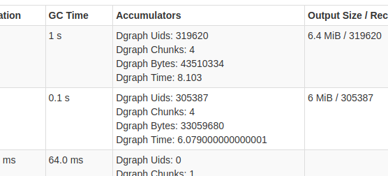

# Spark Dgraph Connector

This project provides an [Apache Spark](https://spark.apache.org/) connector
for [Dgraph databases](https://dgraph.io/).
It comes with a [Spark Data Source](https://spark.apache.org/docs/latest/sql-data-sources.html)
to read graphs from a Dgraph cluster directly into
[DataFrame](https://spark.apache.org/docs/latest/sql-programming-guide.html) or
[GraphX](https://spark.apache.org/docs/latest/graphx-programming-guide.html).

Example code:

    val target = "localhost:9080"

    import uk.co.gresearch.spark.dgraph.graphx._
    val graph: Graph[VertexProperty, EdgeProperty] = spark.read.dgraph(target)

    import uk.co.gresearch.spark.dgraph.connector._
    val triples: DataFrame = spark.read.dgraphTriples(target)
    val edges: DataFrame = spark.read.dgraphEdges(target)
    val nodes: DataFrame = spark.read.dgraphNodes(target)

## Limitations

The connector is at an early stage, but is being continuously developed. It has the following limitations:

- **Read-only**: The connector does not support mutating the graph ([issue #8](https://github.com/G-Research/spark-dgraph-connector/issues/8)).
- **Not transaction-aware**: Individual partitions do not read the same transaction. The graph should not be
  modified while reading it into Spark ([issue #6](https://github.com/G-Research/spark-dgraph-connector/issues/6)).
- **No filter push-down**: The connector does not support any filter push-down. It always reads the
  entire graph into Spark where then filters get applied (e.g. filter for predicates, uids or values) ([issue #7](https://github.com/G-Research/spark-dgraph-connector/issues/7)).
- **Type system**: The connector can only read data for nodes that have a type ([issue #4](https://github.com/G-Research/spark-dgraph-connector/issues/4)) (`dgraph.type`)
  and use predicates that are in the node's type schema ([issue #5](https://github.com/G-Research/spark-dgraph-connector/issues/5)).
- **Language tags & facets**: The connector cannot read any string values with language tags or facets.
- **Maturity**: Untested with non-trivial-size real-world graphs.

Beside the **language tags & facets**, which is a limitation of Dgraph, all the other issues mentioned
above will be addressed in the near future.

## Using Spark Dgraph Connector

The Spark Dgraph Connector is available for Spark 2.4 and Spark 3.0, both with Scala 2.12.
Use Maven artifact ID `spark-dgraph-connector_2.12`. The Spark version is part of the package version,
e.g. 0.3.0-2.4 and 0.3.0-3.0, respectively.
Minor versions are kept in sync between those two packages, such that identical minor versions contain identical feature sets (where supported by the respective Spark version).

### SBT

Add this line to your `build.sbt` file to use the latest version for Spark 2.4:

```sbt
libraryDependencies += "uk.co.gresearch.spark" %% "spark-dgraph-connector" % "0.3.0-2.4"
```

### Maven

Add this dependency to your `pom.xml` file to use the latest version:

```xml
<dependency>
  <groupId>uk.co.gresearch.spark</groupId>
  <artifactId>spark-dgraph-connector_2.12</artifactId>
  <version>0.3.0-2.4</version>
</dependency>
```

## Examples

The following examples use a local Dgraph instance setup as described in the
[Dgraph Quickstart Guide](https://dgraph.io/docs/get-started).
Run [Step 1](https://dgraph.io/docs/get-started/#step-1-run-dgraph) to start an instance,
[Step 2](https://dgraph.io/docs/get-started/#step-2-run-mutation) to load example graph data, and
[Step 3](https://dgraph.io/docs/get-started/#step-3-alter-schema) to add a schema. These steps are
provided in the following scripts:

    ./dgraph-instance.start.sh
    ./dgraph-instance.insert.sh
    ./dgraph-instance.schema.sh

The connection to Dgraph can be established via a `target`, which is the [hostname and gRPC port of a
Dgraph Alpha node](https://dgraph.io/docs/deploy/#cluster-setup) in the form `<hostname>:<port>`.
With our example instance started above, we can use `localhost:9080` as the target.

### GraphX

You can load the entire Dgraph database into an
[Apache Spark GraphX](https://spark.apache.org/docs/latest/graphx-programming-guide.html)
graph. For example:

    import uk.co.gresearch.spark.dgraph.graphx._

    val graph = spark.read.dgraph("localhost:9080")

Example code to perform a [PageRank](https://spark.apache.org/docs/latest/graphx-programming-guide.html#pagerank)
computation on the graph to test that the connector is working:

    val pageRank = graph.pageRank(0.0001)
    pageRank.vertices.foreach(println)

### DataFrame

Dgraph data can be loaded into Spark DataFrames in various forms:

- Triples
  - fully typed values
  - string values
- Nodes
  - fully typed properties
  - wide schema
- Edges

#### Typed Triples

You can load the entire Dgraph database as triples into an [Apache Spark DataFrame](https://spark.apache.org/docs/latest/sql-programming-guide.html#datasets-and-dataframes). For example:

    import uk.co.gresearch.spark.dgraph.connector._

    val triples = spark.read.dgraphTriples("localhost:9080")

The returned `DataFrame` has the following schema:

    root
     |-- subject: long (nullable = false)
     |-- predicate: string (nullable = true)
     |-- objectUid: long (nullable = true)
     |-- objectString: string (nullable = true)
     |-- objectLong: long (nullable = true)
     |-- objectDouble: double (nullable = true)
     |-- objectTimestamp: timestamp (nullable = true)
     |-- objectBoolean: boolean (nullable = true)
     |-- objectGeo: string (nullable = true)
     |-- objectPassword: string (nullable = true)
     |-- objectType: string (nullable = true)

The object value gets stored in exactly one of the `object*` (except `objectType`) columns, depending on the type of the value.
The `objectType` column provides the type of the object. Here is an example:

|subject|predicate   |objectString                                  |objectLong|objectDouble|objectTimestamp    |objectBoolean|objectGeo|objectPassword|objectType|
|:-----:|:----------:|:--------------------------------------------:|:--------:|:----------:|:-----------------:|:-----------:|:-------:|:------------:|:--------:|
|1      |dgraph.type |Person                                        |null      |null        |null               |null         |null     |null          |string    |
|1      |name        |Luke Skywalker                                |null      |null        |null               |null         |null     |null          |string    |
|2      |dgraph.type |Person                                        |null      |null        |null               |null         |null     |null          |string    |
|2      |name        |Princess Leia                                 |null      |null        |null               |null         |null     |null          |string    |
|3      |dgraph.type |Film                                          |null      |null        |null               |null         |null     |null          |string    |
|3      |name        |Star Wars: Episode IV - A New Hope            |null      |null        |null               |null         |null     |null          |string    |
|3      |release_date|null                                          |null      |null        |1977-05-25 00:00:00|null         |null     |null          |timestamp |
|3      |revenue     |null                                          |null      |7.75E8      |null               |null         |null     |null          |double    |
|3      |running_time|null                                          |121       |null        |null               |null         |null     |null          |long      |

This model allows you to store the fully-typed triples in a `DataFrame`.

#### String Triples

The triples can also be loaded in an un-typed, narrow form:

    import uk.co.gresearch.spark.dgraph.connector._

    spark
      .read
      .option(TriplesModeOption, TriplesModeStringOption)
      .dgraphTriples("localhost:9080")
      .show

The resulting `DataFrame` has the following schema:

    root
     |-- subject: long (nullable = false)
     |-- predicate: string (nullable = true)
     |-- objectString: string (nullable = true)
     |-- objectType: string (nullable = true)

The object value gets stored as a string in `objectString`, and `objectType` provides you
with the actual type of the object. Here is an example:

|subject|predicate   |objectString                                  |objectType|
|:-----:|:----------:|:--------------------------------------------:|:--------:|
|1      |dgraph.type |Person                                        |string    |
|1      |name        |Luke Skywalker                                |string    |
|2      |dgraph.type |Person                                        |string    |
|2      |name        |Princess Leia                                 |string    |
|3      |dgraph.type |Film                                          |string    |
|3      |revenue     |7.75E8                                        |double    |
|3      |running_time|121                                           |long      |
|3      |starring    |1                                             |uid       |
|3      |starring    |2                                             |uid       |
|3      |starring    |6                                             |uid       |
|3      |director    |7                                             |uid       |
|3      |name        |Star Wars: Episode IV - A New Hope            |string    |
|3      |release_date|1977-05-25 00:00:00.0                         |timestamp |

#### Typed Nodes

You can load all nodes into a `DataFrame` in a fully-typed form. This contains all the nodes' properties but no edges to other nodes:

    import uk.co.gresearch.spark.dgraph.connector._

    spark.read.dgraphNodes("localhost:9080")

The returned `DataFrame` has the following schema:

    root
     |-- subject: long (nullable = false)
     |-- predicate: string (nullable = true)
     |-- objectString: string (nullable = true)
     |-- objectLong: long (nullable = true)
     |-- objectDouble: double (nullable = true)
     |-- objectTimestamp: timestamp (nullable = true)
     |-- objectBoolean: boolean (nullable = true)
     |-- objectGeo: string (nullable = true)
     |-- objectPassword: string (nullable = true)
     |-- objectType: string (nullable = true)

The schema of the returned `DataFrame` is very similar to the typed triples schema, except that there is no `objectUid` column linking to other nodes. Here is an example:

|subject|predicate   |objectString                                  |objectLong|objectDouble|objectTimestamp    |objectBoolean|objectGeo|objectPassword|objectType|
|:-----:|:----------:|:--------------------------------------------:|:--------:|:----------:|:-----------------:|:-----------:|:-------:|:------------:|:--------:|
|1      |dgraph.type |Person                                        |null      |null        |null               |null         |null     |null          |string    |
|1      |name        |Luke Skywalker                                |null      |null        |null               |null         |null     |null          |string    |
|2      |dgraph.type |Person                                        |null      |null        |null               |null         |null     |null          |string    |
|2      |name        |Princess Leia                                 |null      |null        |null               |null         |null     |null          |string    |
|3      |dgraph.type |Film                                          |null      |null        |null               |null         |null     |null          |string    |
|3      |revenue     |null                                          |null      |7.75E8      |null               |null         |null     |null          |double    |
|3      |running_time|null                                          |121       |null        |null               |null         |null     |null          |long      |
|3      |name        |Star Wars: Episode IV - A New Hope            |null      |null        |null               |null         |null     |null          |string    |
|3      |release_date|null                                          |null      |null        |1977-05-25 00:00:00|null         |null     |null          |timestamp |

#### Wide Nodes

Nodes can also be loaded in a wide, fully-typed format:

    import uk.co.gresearch.spark.dgraph.connector._

    spark
      .read
      .option(NodesModeOption, NodesModeWideOption)
      .dgraphNodes("localhost:9080")

The returned `DataFrame` has the following schema format, which is dependent on the schema of the underlying Dgraph database.
Node properties are stored in typed columns and are ordered alphabetically (property columns start after the `subject` column):

    root
     |-- subject: long (nullable = false)
     |-- dgraph.graphql.schema: string (nullable = true)
     |-- dgraph.type: string (nullable = true)
     |-- name: string (nullable = true)
     |-- release_date: timestamp (nullable = true)
     |-- revenue: double (nullable = true)
     |-- running_time: long (nullable = true)

Note: The graph schema could become very large and therefore the `DataFrame` could become prohibitively wide.

|subject|dgraph.graphql.schema|dgraph.type|name                                          |release_date       |revenue|running_time|
|:-----:|:-------------------:|:---------:|:--------------------------------------------:|:-----------------:|:-----:|:----------:|
|1      |null                 |Person     |Luke Skywalker                                |null               |null   |null        |
|2      |null                 |Person     |Princess Leia                                 |null               |null   |null        |
|3      |null                 |Film       |Star Wars: Episode IV - A New Hope            |1977-05-25 00:00:00|7.75E8 |121         |
|4      |null                 |Film       |Star Wars: Episode VI - Return of the Jedi    |1983-05-25 00:00:00|5.72E8 |131         |
|5      |null                 |Film       |Star Trek: The Motion Picture                 |1979-12-07 00:00:00|1.39E8 |132         |
|6      |null                 |Person     |Han Solo                                      |null               |null   |null        |
|7      |null                 |Person     |George Lucas                                  |null               |null   |null        |
|8      |null                 |Person     |Irvin Kernshner                               |null               |null   |null        |
|9      |null                 |Person     |Richard Marquand                              |null               |null   |null        |
|10     |null                 |Film       |Star Wars: Episode V - The Empire Strikes Back|1980-05-21 00:00:00|5.34E8 |124         |

Note: The Wide Nodes source enforces the [predicate partitioner](#partitioning-by-predicates) to produce a single partition.

#### Edges

Edges can be loaded as follows:

    import uk.co.gresearch.spark.dgraph.connector._

    spark.read.dgraphEdges("localhost:9080")

The returned `DataFrame` has the following simple schema:

    root
     |-- subject: long (nullable = false)
     |-- predicate: string (nullable = true)
     |-- objectUid: long (nullable = false)

Though there is only a single `object` column for the destination node, it is called `objectUid` to align with the `DataFrame` schemata above.

|subject|predicate|objectUid|
|:-----:|:-------:|:-------:|
|3      |starring |1        |
|3      |starring |2        |
|3      |starring |6        |
|3      |director |7        |
|4      |starring |1        |
|4      |starring |2        |
|4      |starring |6        |
|4      |director |9        |
|10     |starring |1        |
|10     |starring |2        |
|10     |starring |6        |
|10     |director |8        |

## Filter Pushdown

The connector supports filter pushdown to improve its efficiency when reading only sub-graphs.
This is supported only in conjunction with the [predicate partitioner](#partitioning-by-predicates).
Spark filters cannot be pushed for any column and any data source because columns have different meaning.
Columns can be of the following types:

|Column Type|Description|Type |Columns|Sources|
|:---------:|-----------|:---:|:-----:|-------|
|subject column|the subject of the row|`long`|`subject`|all [DataFrame sources](#dataframe)|
|predicate column|the predicate of the row|`string`|`predicate`|all but [Wide Nodes source](#wide-nodes)|
|predicate value column|the value of a specific predicate, column name is predicate name|*any*|one column for each predicate in the schema, e.g. `dgraph.type`|[Wide Nodes source](#wide-nodes)|
|object value columns|object value of the row|`long`<br/>`string`<br/>`long`<br/>`double`<br/>`timestamp`<br/>`boolean`<br/>`geo`<br/>`password`|`objectUid`<br>`objectString`<br>`objectLong`<br>`objectDouble`<br>`objectTimestamp`<br>`objectBoolean`<br>`objectGeo`<br>`objectPassword`|all but [Wide Nodes source](#Wide-nodes)<br>the [String Triples source](#string-triples) has only `objectString`<br>the [Typed Triples source](#typed-triples) lacks the `objectUid`<br>the [Edges source](#edges) has only `objectUid`|
|object type column|the type of the object|`string`|`objectType`|all but [Wide Nodes](#wide-nodes) and [Edges](#edges) source|

The following table lists all supported Spark filters:

|Spark Filter|Supported Columns|Example|
|:----------:|-------|-------|
|`EqualTo`   |<ul><li>predicate column</li><li>predicate value column</li><li>object value columns (not for [String Triples source](#string-triples))</li><li>object type column</li></ul>|<ul><li>`.where($"predicate" === "dgraph.type")`</li><li>`.where($"dgraph.type" === "Person")`</li><li>`.where($"objectLong" === 123)`</li><li>`.where($"objectType" === "string")`</li></ul>|
|`In`        |<ul><li>predicate column</li><li>predicate value column</li><li>object value columns (not for [String Triples source](#string-triples))</li><li>object type column</li></ul>|<ul><li>`.where($"predicate".isin("release_date", "revenue"))`</li><li>`.where($"dgraph.type".isin("Person","Film"))`</li><li>`.where($"objectLong".isin(123,456))`</li><li>`.where($"objectType".isin("string","long"))`</li></ul>|
|`IsNotNull` |<ul><li>object value columns (not for [String Triples source](#string-triples))</li></ul>|<ul><li>`.where($"dgraph.type".isNotNull)`</li><li>`.where($"objectLong".isNotNull)`</li></ul>|

## Metrics

The connector collects metrics per partition that provide insights in throughout and timing of the communication
to the Dgraph cluster. For each request to Dgraph (a chunk), the number of received bytes, uids and retrieval time are recorded and
summed per partition. The values can be seen on the Spark UI for the respective stages that performs the read:



The connector uses [Spark Accumulators](http://spark.apache.org/docs/1.6.2/api/java/org/apache/spark/Accumulator.html)
to collect these metrics. They can be accessed by the Spark driver via a `SparkListener`:

      val handler = new SparkListener {
        override def onStageCompleted(stageCompleted: SparkListenerStageCompleted): Unit =
          stageCompleted.stageInfo.accumulables.values.foreach(println)
      }

      spark.sparkContext.addSparkListener(handler)
      spark.read.dgraphTriples("localhost:9080").count()


The following metrics are available:

|Metric|Description|
|------|-----------|
|`Dgraph Bytes`|Size of JSON responses from the Dgraph cluster in Byte.|
|`Dgraph Chunks`|Number of requests sent to the Dgraph cluster.|
|`Dgraph Time`|Time waited for Dgraph to respond in Seconds.|
|`Dgraph Uids`|Number of Uids read.|


## Special Use Cases

### Nodes without types (dgraph.type)

A graph where nodes do not have any type (`dgraph.type`) can only be read with the `PredicatePartitioner` (see below),
and then only with a single predicate per partition.
Any other partitioner relies on the [Dgraphs type system](https://dgraph.io/docs/query-language/#type-system)
and will therefore not "see" those nodes ([issue #4](https://github.com/G-Research/spark-dgraph-connector/issues/4)).

### Nodes with types and predicates that are not part of its types

A graph where nodes have predicates that are not part of the nodes' types can only be read with the `PredicatePartitioner` (see below).
Any other partitioner relies on the [Dgraphs type system](https://dgraph.io/docs/query-language/#type-system)
and will therefore not "see" those predicates ([issue #5](https://github.com/G-Research/spark-dgraph-connector/issues/5)).

## Partitioning

Partitioning your Dgraph graph is essential to be able to load large quantities of graph data into Spark.
Spark splits data into partitions, where ideally all partitions have the same size and are of decent size.
Partitions that are too large will kill your Spark executor as they won't fit into memory. When partitions
are too small your Spark job becomes inefficient and slow, but will not fail.

Each partition connects to the Dgraph cluster and reads a specific sub-graph. Partitions are non-overlapping.

This connector provides various ways to partition your graph. When the default partitioning does not work for your
specific use case, try a more appropriate partitioning scheme.

### Partitioner

The following `Partitioner` implementations are available:

| Partitioner                       | partition by              | Description | Use Case |
|:---------------------------------:|:-------------------------:|-------------|----------|
| Singleton                         | _nothing_                 | Provides a single partition for the entire graph. | Unit Tests and small graphs that fit into a single partition. Can be used for large graphs if combined with a "by uid" partitioner. |
| Predicate                         | predicate                 | Provides multiple partitions with at most `P` predicates per partition where `P` defaults to `1000`. Picks multiple predicates from the same Dgraph group. | Large graphs where each predicate fits into a partition, otherwise combine with Uid Range partitioner. Skewness of predicates reflects skewness of partitions. |
| Uid Range                         | uids                      | Each partition has at most `N` uids where `N` defaults to `1000000`. | Large graphs where single `uid`s fit into a partition. Can be combined with any predicate partitioner, otherwise induces internal Dgraph cluster communication across groups. |
| Predicate + Uid Range _(default)_ | predicates + uids         | Partitions by predicate first (see Predicate Partitioner), then each partition gets partitioned by uid (see Uid Partitioner) | Graphs of any size. |


#### Partitioning by Predicates

The Dgraph data can be partitioned by predicates. Each partition then contains a distinct set of predicates.
Those partitions connect only to alpha nodes that contain those predicates. Hence, these reads are all
locally to the alpha nodes and induce no Dgraph cluster internal communication.

#### Partitioning by Uids

A `uid` represents a node or vertice in Dgraph terminology. A "Uid Range" partitioning splits
the graph by the subject of the graph triples. This can be combined with predicate partitioning,
which serves as an orthogonal partitioning. Without predicate partitioning, `uid` partitioning
induces internal Dgraph cluster communication across the groups.

The uid partitioning always works on top of a predicate partitioner. If none is defined a singleton partitioner is used.
The number of uids of each underlying partition has to be estimated. Once the number of uids is estimated,
the partition is further split into ranges of that uid space.

The space of existing `uids` is split into ranges of `N` `uids` per partition. The `N` defaults to `1000000`
and can be configured via `dgraph.partitioner.uidRange.uidsPerPartition`. The `uid`s are allocated to
partitions in ascending order. If vertex size is skewed and a function of `uid`, then partitions will be skewed as well.

Note: With uid partitioning, the chunk size configured via `dgraph.chunkSize` should be at least a 10th of
the number of uids per partition configured via `dgraph.partitioner.uidRange.uidsPerPartition` to avoid
inefficiency due to chunks overlapping with partition borders. When your result is sparse w.r.t. the uid space
set the chunk size to 100th or less.

<!-- there is only one estimator left, no need to mention this until we have another
The estimator can be selected with the `dgraph.partitioner.uidRange.estimator` option. These estimators are available:

##### Cluster MaxLeaseId

The Dgraph cluster [maintains a maxLeaseId](https://dgraph.io/docs/deploy/#more-about-state-endpoint), which is the largest possible uid.
It grows as new uids are added to the cluster, so it serves as an upper estimate of the actual largest uid.
Compared to the count estimator it is very cheap to retrieve this value.
This estimator can be selected with the `maxLeaseId` value.
-->

### Streamed Partitions

The connector reads each partition from Dgraph in a streamed fashion. It splits up a partition into smaller chunks,
where each chunk contains `100000` uids. This chunk size can be configured via `dgraph.chunkSize`.
Each chunk sends a single query sent to Dgraph. The chunk size limits the size of the result.
Due to the low memory footprint of the connector, Spark could read your entire graph via a single partition
(you would have to `repartition` the read DataFrame to make Spark shuffle the data properly).
However, this would be would slow, but it proves the connector can handle any size of graph with fixed executor memory requirement.

## Dependencies

The GRPC library used by the dgraph client requires `guava >= 20.0`, hence the:

    <dependency>
      <groupId>com.google.guava</groupId>
      <artifactId>guava</artifactId>
      <version>[20.0-jre,)</version>
    </dependency>

…in the `pom.xml`file. Otherwise, we would see this error:

      java.lang.NoSuchMethodError: 'void com.google.common.base.Preconditions.checkArgument(boolean, java.lang.String, char, java.lang.Object)'
      at io.grpc.Metadata$Key.validateName(Metadata.java:629)
      at io.grpc.Metadata$Key.<init>(Metadata.java:637)
      at io.grpc.Metadata$Key.<init>(Metadata.java:567)
      at io.grpc.Metadata$AsciiKey.<init>(Metadata.java:742)
      at io.grpc.Metadata$AsciiKey.<init>(Metadata.java:737)
      at io.grpc.Metadata$Key.of(Metadata.java:593)
      at io.grpc.Metadata$Key.of(Metadata.java:589)
      at io.grpc.internal.GrpcUtil.<clinit>(GrpcUtil.java:79)
      at io.grpc.internal.AbstractManagedChannelImplBuilder.<clinit>(AbstractManagedChannelImplBuilder.java:84)
      at uk.co.gresearch.spark.dgraph.connector.package$.toChannel(package.scala:113)

Furthermore, we need to set `protobuf-java >= 3.4.0` in the `pom.xml` file:

    <dependency>
      <groupId>com.google.protobuf</groupId>
      <artifactId>protobuf-java</artifactId>
      <version>[3.4.0,]</version>
    </dependency>

…to get rid of these errors:

      java.lang.NoClassDefFoundError: com/google/protobuf/GeneratedMessageV3
      at java.base/java.lang.ClassLoader.defineClass1(Native Method)
      at java.base/java.lang.ClassLoader.defineClass(ClassLoader.java:1017)
      at java.base/java.security.SecureClassLoader.defineClass(SecureClassLoader.java:174)
      at java.base/jdk.internal.loader.BuiltinClassLoader.defineClass(BuiltinClassLoader.java:800)
      at java.base/jdk.internal.loader.BuiltinClassLoader.findClassOnClassPathOrNull(BuiltinClassLoader.java:698)
      at java.base/jdk.internal.loader.BuiltinClassLoader.loadClassOrNull(BuiltinClassLoader.java:621)
      at java.base/jdk.internal.loader.BuiltinClassLoader.loadClass(BuiltinClassLoader.java:579)
      at java.base/jdk.internal.loader.ClassLoaders$AppClassLoader.loadClass(ClassLoaders.java:178)
      at java.base/java.lang.ClassLoader.loadClass(ClassLoader.java:522)
      at io.dgraph.AsyncTransaction.<init>(AsyncTransaction.java:48)
      ...
      Cause: java.lang.ClassNotFoundException: com.google.protobuf.GeneratedMessageV3
      at java.base/jdk.internal.loader.BuiltinClassLoader.loadClass(BuiltinClassLoader.java:581)
      at java.base/jdk.internal.loader.ClassLoaders$AppClassLoader.loadClass(ClassLoaders.java:178)
      at java.base/java.lang.ClassLoader.loadClass(ClassLoader.java:522)
      at java.base/java.lang.ClassLoader.defineClass1(Native Method)
      at java.base/java.lang.ClassLoader.defineClass(ClassLoader.java:1017)
      at java.base/java.security.SecureClassLoader.defineClass(SecureClassLoader.java:174)
      at java.base/jdk.internal.loader.BuiltinClassLoader.defineClass(BuiltinClassLoader.java:800)
      at java.base/jdk.internal.loader.BuiltinClassLoader.findClassOnClassPathOrNull(BuiltinClassLoader.java:698)
      at java.base/jdk.internal.loader.BuiltinClassLoader.loadClassOrNull(BuiltinClassLoader.java:621)
      at java.base/jdk.internal.loader.BuiltinClassLoader.loadClass(BuiltinClassLoader.java:579)

    Exception in thread "grpc-default-executor-0" java.lang.NoSuchMethodError: 'void com.google.protobuf.GeneratedMessageV3.serializeStringMapTo(com.google.protobuf.CodedOutputStream, com.google.protobuf.MapField, com.google.protobuf.MapEntry, int)'
        at io.dgraph.DgraphProto$Request.writeTo(DgraphProto.java:477)
        at com.google.protobuf.AbstractMessageLite.writeTo(AbstractMessageLite.java:83)
        at io.grpc.protobuf.lite.ProtoInputStream.drainTo(ProtoInputStream.java:52)
        at io.grpc.internal.MessageFramer.writeToOutputStream(MessageFramer.java:269)
        at io.grpc.internal.MessageFramer.writeKnownLengthUncompressed(MessageFramer.java:230)
        at io.grpc.internal.MessageFramer.writeUncompressed(MessageFramer.java:168)
        at io.grpc.internal.MessageFramer.writePayload(MessageFramer.java:141)
        at io.grpc.internal.AbstractStream.writeMessage(AbstractStream.java:53)
        at io.grpc.internal.ForwardingClientStream.writeMessage(ForwardingClientStream.java:37)
        at io.grpc.internal.DelayedStream$6.run(DelayedStream.java:257)
        at io.grpc.internal.DelayedStream.drainPendingCalls(DelayedStream.java:163)
        at io.grpc.internal.DelayedStream.setStream(DelayedStream.java:132)
        at io.grpc.internal.DelayedClientTransport$PendingStream.createRealStream(DelayedClientTransport.java:358)
        at io.grpc.internal.DelayedClientTransport$PendingStream.access$300(DelayedClientTransport.java:341)
        at io.grpc.internal.DelayedClientTransport$5.run(DelayedClientTransport.java:300)
        at java.base/java.util.concurrent.ThreadPoolExecutor.runWorker(ThreadPoolExecutor.java:1128)
        at java.base/java.util.concurrent.ThreadPoolExecutor$Worker.run(ThreadPoolExecutor.java:628)
        at java.base/java.lang.Thread.run(Thread.java:834)

    java.lang.NoSuchMethodError: com.google.protobuf.AbstractMessageLite$Builder.addAll(Ljava/lang/Iterable;Ljava/util/List;)V
        at io.dgraph.DgraphProto$TxnContext$Builder.addAllKeys(DgraphProto.java:7656)
        at io.dgraph.AsyncTransaction.mergeContext(AsyncTransaction.java:273)
        at io.dgraph.AsyncTransaction.lambda$doRequest$0(AsyncTransaction.java:183)
        at java.util.concurrent.CompletableFuture.uniApply(CompletableFuture.java:616)
        at java.util.concurrent.CompletableFuture$UniApply.tryFire(CompletableFuture.java:591)
        at java.util.concurrent.CompletableFuture.postComplete(CompletableFuture.java:488)
        at java.util.concurrent.CompletableFuture.complete(CompletableFuture.java:1975)
        at io.dgraph.StreamObserverBridge.onNext(StreamObserverBridge.java:27)
        at io.grpc.stub.ClientCalls$StreamObserverToCallListenerAdapter.onMessage(ClientCalls.java:436)
        at io.grpc.ForwardingClientCallListener.onMessage(ForwardingClientCallListener.java:33)
        at io.grpc.ForwardingClientCallListener.onMessage(ForwardingClientCallListener.java:33)
        at io.grpc.internal.ClientCallImpl$ClientStreamListenerImpl$1MessagesAvailable.runInternal(ClientCallImpl.java:610)
        at io.grpc.internal.ClientCallImpl$ClientStreamListenerImpl$1MessagesAvailable.runInContext(ClientCallImpl.java:595)
        at io.grpc.internal.ContextRunnable.run(ContextRunnable.java:37)
        at io.grpc.internal.SerializingExecutor.run(SerializingExecutor.java:123)
        at java.util.concurrent.ThreadPoolExecutor.runWorker(ThreadPoolExecutor.java:1149)
        at java.util.concurrent.ThreadPoolExecutor$Worker.run(ThreadPoolExecutor.java:624)
        at java.lang.Thread.run(Thread.java:748)

## Testing

Some unit tests require a Dgraph cluster running at `localhost:9080`. It has to be set up as
described in the [Examples](#examples) section. If that cluster is not running, the unit tests will
launch and set up such a cluster for you. This requires `docker` to be installed on your machine
and will make the tests take longer. If you run those tests frequently it is recommended you run
the cluster setup yourself.
